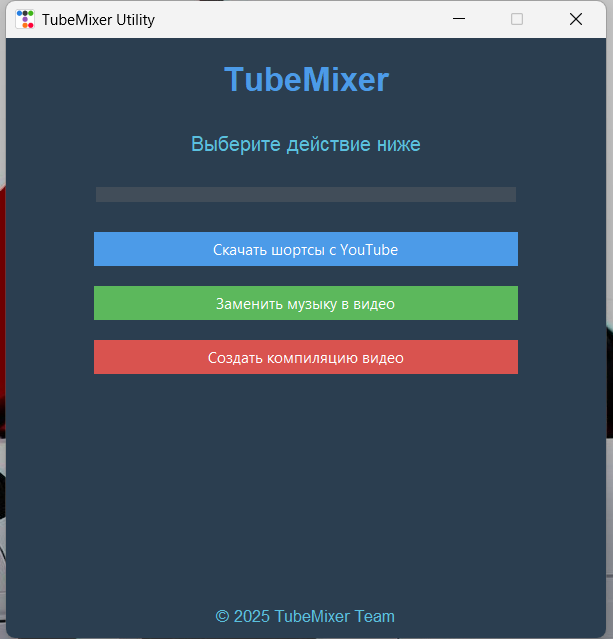

# TubeMixer


TubeMixer — утилита для работы с видео и аудио. Программа позволяет скачивать шортсы с YouTube, заменять музыку в роликах и создавать подборки клипов. Интерфейс построен на Tkinter и ориентирован на простоту использования.

## Возможности
- **Скачивание шортсов с YouTube.** Загрузка коротких видео по поисковому запросу при помощи `yt-dlp`.
- **Замена музыки в видео.** Подмена аудиодорожки выбранным файлом с автоматической подгонкой длительности.
- **Создание компиляции видео.** Объединение нескольких клипов в один файл.
- **Компиляция случайных клипов.** Автоматический выбор роликов для быстрой нарезки.

## Установка и запуск
1. Склонируйте репозиторий:
   ```bash
   git clone https://github.com/your-username/TubeMixer.git
   cd TubeMixer
   ```
2. Установите зависимости:
   ```bash
   pip install -r requirements.txt
   ```
3. Запустите приложение:
   ```bash
   python main.py
   ```

### Запуск на Windows без установки
В каталоге `dist` находится собранный `TubeMixer.exe`. Дважды кликните по файлу, чтобы открыть программу.

## Требования
- Python 3.6+
- moviepy
- yt-dlp
- ttkbootstrap

## Лицензия
Проект распространяется под лицензией MIT. См. файл [LICENSE.txt](LICENSE.txt) для подробностей.

---

## English

### Overview
TubeMixer is a utility for working with video and audio. It can download Shorts from YouTube, replace music in clips, and create compilations. The interface is built with Tkinter and aims for simplicity.

### Features
- **Download Shorts from YouTube.** Fetch short videos by search query using `yt-dlp`.
- **Replace music in videos.** Substitute the audio track with a selected file and automatically adjust its length.
- **Create video compilations.** Merge multiple clips into one file.
- **Random clip compilation.** Automatically pick clips for quick mashups.

### Installation and launch
1. Clone the repository:
   ```bash
   git clone https://github.com/your-username/TubeMixer.git
   cd TubeMixer
   ```
2. Install dependencies:
   ```bash
   pip install -r requirements.txt
   ```
3. Run the application:
   ```bash
   python main.py
   ```

#### Running on Windows without installation
The `dist` directory contains a prebuilt `TubeMixer.exe`. Double-click the file to open the program.

### Requirements
- Python 3.6+
- moviepy
- yt-dlp
- ttkbootstrap

### License
This project is distributed under the MIT License. See [LICENSE.txt](LICENSE.txt) for details.

---

## 中文

### 概述
TubeMixer 是一个用于处理视频和音频的工具。它可以从 YouTube 下载 Shorts，替换视频中的音乐，并创建剪辑合集。界面基于 Tkinter，使用简便。

### 功能
- **下载 YouTube Shorts。** 使用 `yt-dlp` 根据搜索词抓取短视频。
- **替换视频音乐。** 将音轨替换为选定文件并自动调整时长。
- **创建视频合辑。** 将多个剪辑合成为一个文件。
- **随机剪辑合辑。** 自动选择剪辑进行快速拼接。

### 安装与启动
1. 克隆仓库：
   ```bash
   git clone https://github.com/your-username/TubeMixer.git
   cd TubeMixer
   ```
2. 安装依赖：
   ```bash
   pip install -r requirements.txt
   ```
3. 运行应用：
   ```bash
   python main.py
   ```

#### 在 Windows 上免安装运行
在 `dist` 目录下有已打包的 `TubeMixer.exe`，双击即可启动程序。

### 运行环境
- Python 3.6+
- moviepy
- yt-dlp
- ttkbootstrap

### 许可证
本项目以 MIT 许可证发布。详情请查看 [LICENSE.txt](LICENSE.txt)。